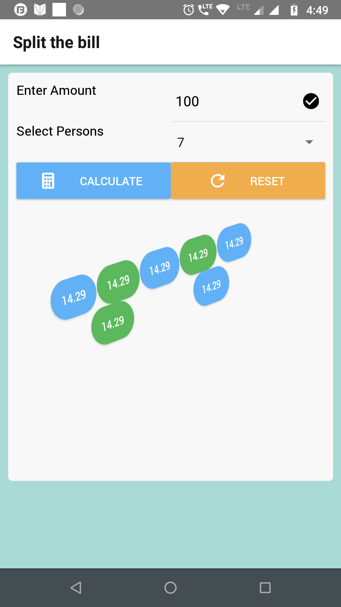

# Split the bill with React-native and Navigation screen



  - To quick start react native project with react [NativeBase].
  - Using [ReactNavigation 3.x].
  - [Native Base] UI library
  - Code only support for android devices.

# Features!

  - Toast 
  - Animation
  - Navigation
  - Split the bill

### Tech


* [ReactNative] 
* [ReactNavigation 3.x] 
* [Native Base]

### Installation

It requires [ReactNative] and [AndroidStudio].

Install the dependencies and run the code.

```sh
$ npm install
$ react-native link react-native-gesture-handler
$ react-native run-android
```

   [ReactNative]: <https://facebook.github.io/react-native/>
   [ReactNavigation 3.x]: <https://reactnavigation.org/docs/en/getting-started.html>
   [AndroidStudio]: <https://developer.android.com/studio/index.html>
   [Native Base]: <https://nativebase.io/>
